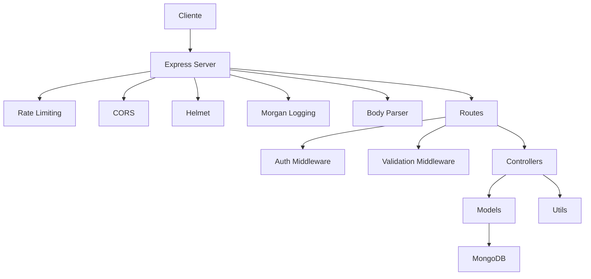
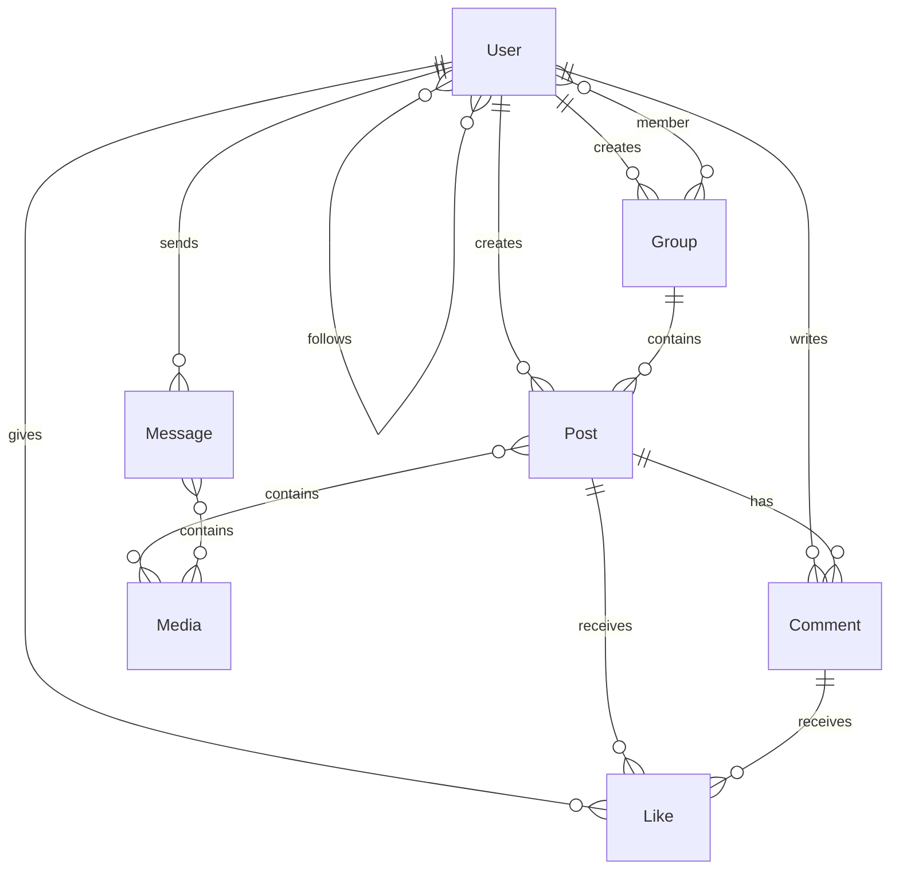

# SocialNet API

Una API REST profesional para una red social enfocada en el arte, grupos, visualización de contenido multimedia, mensajes directos e interacción entre usuarios.

## 🚀 Características

- **Autenticación JWT** con refresh tokens
- **Gestión de usuarios** con perfiles y seguidores
- **Publicaciones** con multimedia, comentarios y likes
- **Grupos** para comunidades
- **Mensajes directos** entre usuarios
- **Subida de archivos** (imágenes, videos, audio)
- **Rate limiting** y seguridad avanzada
- **Validación robusta** con express-validator
- **Manejo de errores** centralizado

## 🛠️ Stack Tecnológico

- **Node.js** con módulos ES6
- **Express.js** para el servidor
- **MongoDB** con Mongoose ODM
- **JWT** para autenticación
- **Multer** para uploads
- **Cloudinary** para storage de media (opcional)
- **Helmet, CORS, Rate Limiting** para seguridad

## 📦 Dependencias

### Obligatorias
- `bcryptjs`: Encriptación de contraseñas
- `cors`: Cross-Origin Resource Sharing
- `dotenv`: Variables de entorno
- `express`: Framework web
- `express-validator`: Validación de datos
- `helmet`: Seguridad HTTP headers
- `jsonwebtoken`: Tokens JWT
- `mongoose`: ODM para MongoDB
- `morgan`: Logging HTTP
- `multer`: Manejo de archivos
- `nodemon`: Desarrollo con hot reload

### Adicionales
- `express-rate-limit`: Rate limiting
- `joi`: Validación adicional
- `cloudinary`: Storage de imágenes en la nube

## 🏗️ Arquitectura



## 📊 Diagrama ERD



## 🚀 Instalación y Ejecución

### Prerrequisitos
- Node.js >= 18
- MongoDB >= 5
- npm o yarn

### Instalación

1. Clona el repositorio:
```bash
git clone <repository-url>
cd backend
```

2. Instala dependencias:
```bash
npm install
```

3. Configura variables de entorno:
Copia `.env` y configura:
```env
NODE_ENV=development
PORT=5000
MONGO_URI=mongodb://127.0.0.1:27017/socialnet
JWT_SECRET=your-jwt-secret
JWT_EXPIRES_IN=15m
JWT_REFRESH_SECRET=your-refresh-secret
JWT_REFRESH_EXPIRES_IN=7d
CORS_ORIGIN=http://localhost:5173
CLOUDINARY_CLOUD_NAME=your-cloud-name
CLOUDINARY_API_KEY=your-api-key
CLOUDINARY_API_SECRET=your-api-secret
```

4. Inicia el servidor:
```bash
# Desarrollo
npm run dev

# Producción
npm start
```

## 📚 API Endpoints

### Autenticación
- `POST /api/v1/auth/register` - Registrar usuario
- `POST /api/v1/auth/login` - Iniciar sesión
- `POST /api/v1/auth/refresh` - Refrescar token

### Usuarios
- `GET /api/v1/users/profile` - Obtener perfil propio
- `PUT /api/v1/users/profile` - Actualizar perfil
- `GET /api/v1/users/:id` - Obtener perfil de usuario
- `POST /api/v1/users/:id/follow` - Seguir/dejar de seguir

### Publicaciones
- `GET /api/v1/posts` - Listar publicaciones (paginado)
- `POST /api/v1/posts` - Crear publicación
- `GET /api/v1/posts/:id` - Obtener publicación
- `PUT /api/v1/posts/:id` - Actualizar publicación
- `DELETE /api/v1/posts/:id` - Eliminar publicación
- `POST /api/v1/posts/:id/like` - Like/unlike publicación

### Grupos
- `GET /api/v1/groups` - Listar grupos
- `POST /api/v1/groups` - Crear grupo
- `POST /api/v1/groups/:id/join` - Unirse a grupo

### Mensajes
- `POST /api/v1/messages` - Enviar mensaje
- `GET /api/v1/messages/conversations` - Listar conversaciones
- `GET /api/v1/messages/:userId` - Obtener mensajes con usuario

## 🔒 Seguridad

- **Rate Limiting**: 100 requests/15min por IP, 5 auth requests/15min
- **Helmet**: Headers de seguridad HTTP
- **CORS**: Control de orígenes permitidos
- **Validación**: Datos sanitizados y validados
- **JWT**: Tokens con expiración corta + refresh tokens
- **Bcrypt**: Contraseñas hasheadas con salt

## 📁 Estructura del Proyecto

```
backend/
├── src/
│   ├── controllers/     # Lógica de negocio
│   ├── middlewares/     # Middlewares personalizados
│   ├── models/         # Esquemas Mongoose
│   ├── routes/         # Definición de rutas
│   ├── utils/          # Utilidades y helpers
│   ├── validators/     # Validaciones express-validator
│   ├── app.js          # Configuración Express
│   └── DataBase/
│       └── Conection.js # Conexión MongoDB
├── uploads/            # Archivos subidos (local)
├── .env                # Variables de entorno
├── .gitignore
├── package.json
├── README.md
└── server.js           # Punto de entrada
```

## 🧪 Testing

Para probar la API, puedes usar herramientas como:
- Postman
- Insomnia
- Thunder Client (VS Code)

### Ejemplo de registro:
```json
POST /api/v1/auth/register
{
  "username": "artista123",
  "email": "artista@example.com",
  "password": "Password123"
}
```

## 📄 Licencia

ISC